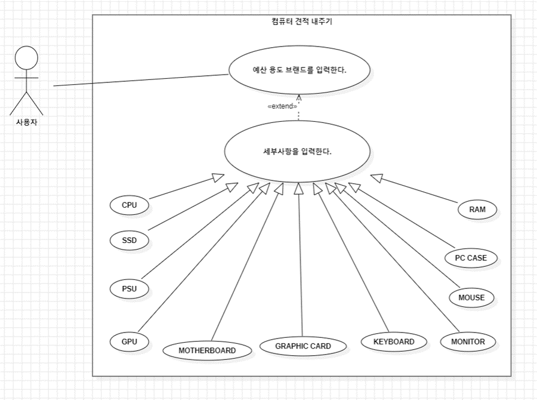
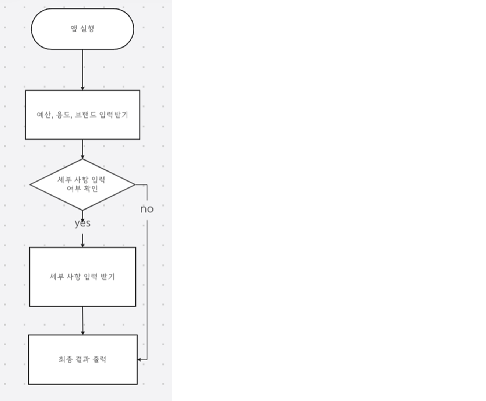

# AI-based Computer Quotation System

## Overview
This project aims to develop an AI system that recommends optimal computer parts based on user requirements, providing a user-friendly interface and real-time updates.

## Technologies Used
- Python
- TensorFlow
- Scikit-learn
- Flask

## Features
- User input for computer requirements
- Real-time recommendations using a trained AI model
- Data visualization and reporting

## Installation
1. Clone the repository:
    ```
    git clone https://github.com/vmffotltka/Portfolio.git
    cd Portfolio/AI_Computer_Quotation
    ```
2. Install required packages:
    ```
    pip install -r requirements.txt
    ```
3. Run the application:
    ```
    python app.py
    ```

## Screenshots


